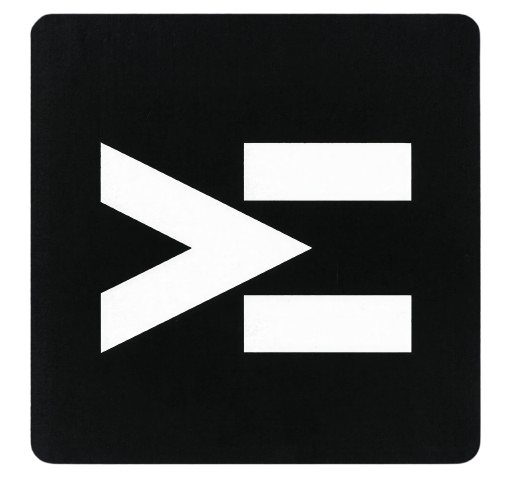
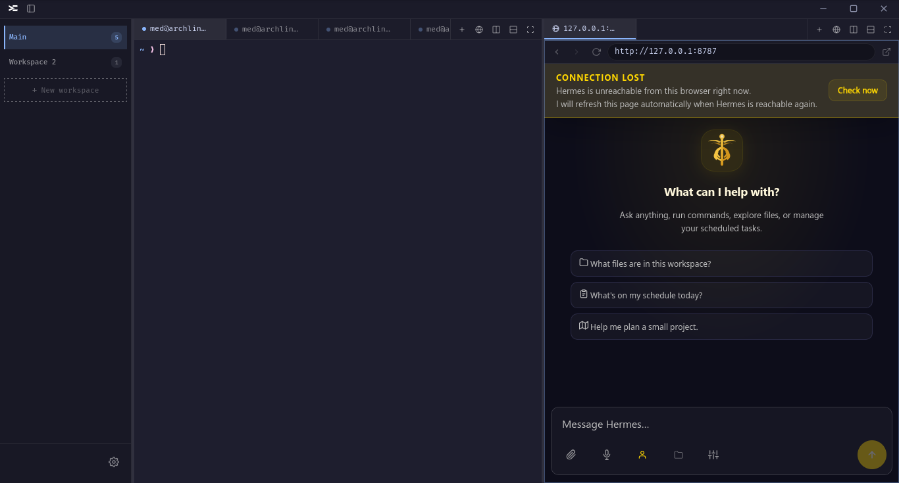
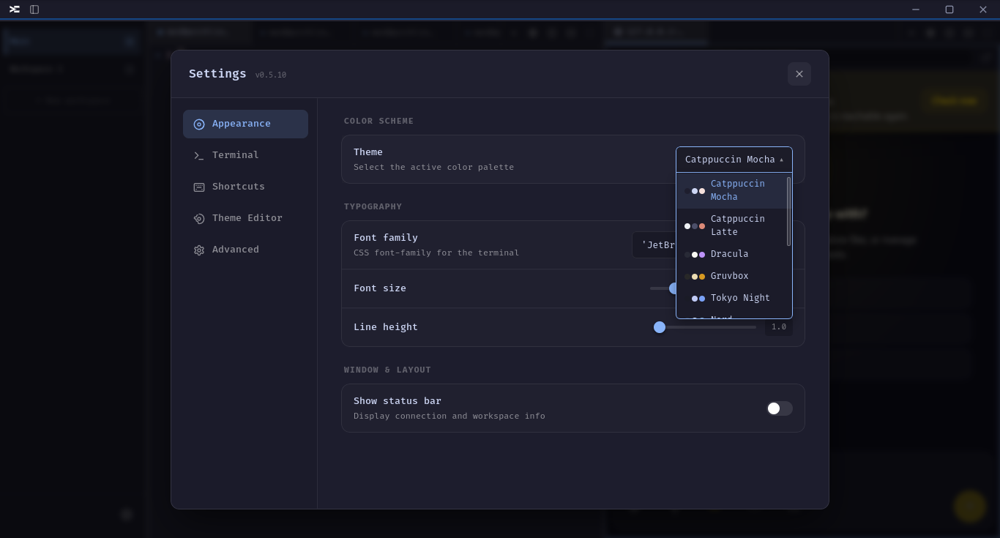

<p align="center">
  
</p>

<h1 align="center">TerminalVibe</h1>

<p align="center">A terminal multiplexer and desktop workspace app with integrated browser, built on Tauri 2.x.</p>

<p align="center">
  
</p>

## Features

- **Multi-workspace** — switch between independent workspace contexts via sidebar
- **Split panes** — recursive horizontal and vertical splits with drag-and-drop reordering
- **Tabbed groups** — each pane holds a tab bar for terminals or browser sessions
- **Built-in browser** — embedded web browsing powered by a local HTTP proxy (strips CSP/X-Frame-Options)
- **PDF viewer** — open PDFs directly in a tab via EmbedPDF
- **Custom themes** — create and edit themes with full color control (terminal + UI backgrounds)
- **Per-terminal font zoom** — Ctrl+Scroll to scale individual terminals
- **Persistent state** — layout, themes, and settings persist across sessions
- **Frameless window** — custom titlebar with logo and workspace toggle

<p align="center">
  
</p>

## Tech Stack

| Layer | Technology |
|-------|-----------|
| Shell | Tauri 2.x (Rust) — PTY management, IPC, window control |
| Frontend | Vanilla JS (single IIFE), xterm.js 5.3, no framework |
| Backend | Node.js — WebSocket PTY server, HTTP browser proxy, static server |

## Project Structure

```
├── app.js                  # Frontend UI logic
├── index.html              # HTML entry point
├── style.css               # Styles
├── server.js               # Node.js backend (PTY + proxy + static)
├── mirror-proxy.js         # Browser proxy helper
├── vendor/                 # Vendored xterm.js, EmbedPDF assets
├── dist/                   # Build output
├── server-dist/            # Bundled server for Tauri
├── src-tauri/
│   ├── src/
│   │   ├── main.rs
│   │   ├── lib.rs          # Setup, PTY spawn, IPC commands
│   │   └── pty.rs          # portable-pty integration
│   ├── Cargo.toml
│   └── tauri.conf.json
└── ARCHITECTURE.md         # Detailed architecture docs
```

## Prerequisites

- Rust toolchain (rustup)
- Node.js 18+
- npm
- Linux: `GDK_BACKEND=x11` and `WEBKIT_DISABLE_COMPOSITING_MODE=1` may be needed for dev

## Development

```bash
npm install
npm run dev
```

## Build

```bash
npm run build
```

Outputs the frontend bundle to `dist/` and produces a Linux AppImage via Tauri CLI.

