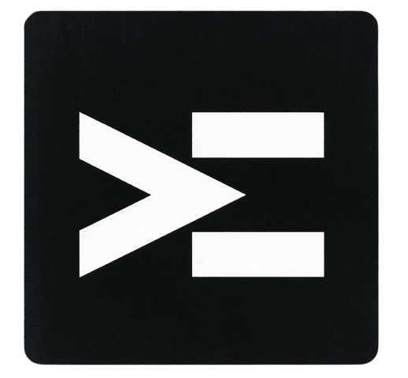
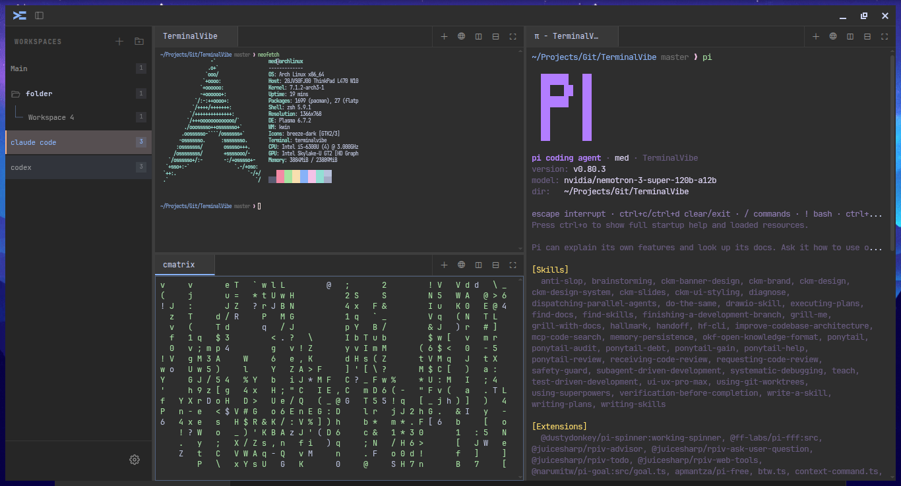
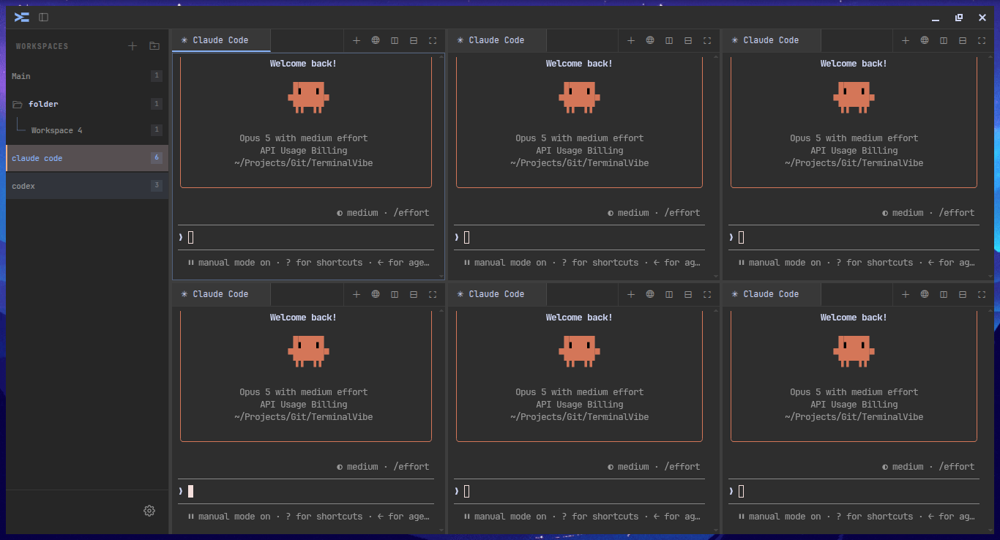
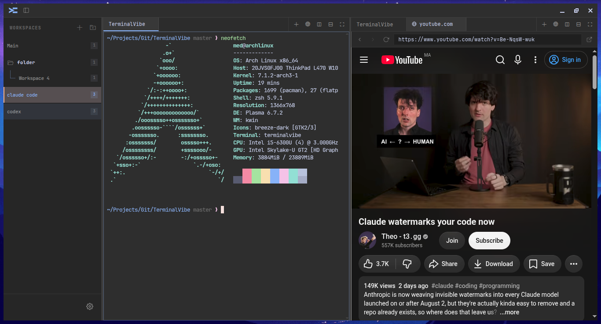
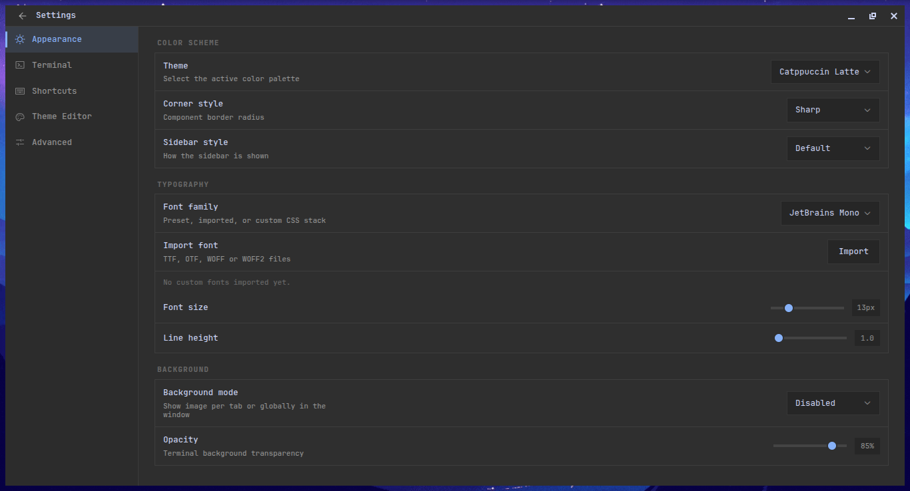

<p align="center">
  
</p>

<h1 align="center">TerminalVibe</h1>

<p align="center">A terminal multiplexer and desktop workspace app with integrated browser, built on Electron.</p>

<p align="center">
  
</p>

## Features

- **Multi-workspace** - switch between independent workspace contexts via sidebar, with drag-and-drop reordering and color customization
- **Split panes** - recursive horizontal and vertical splits with drag-and-drop terminal reordering between panes
- **Tabbed groups** - each pane holds a tab bar for terminals or browser sessions
- **Built-in browser** - embedded web browsing with URL bar, navigation (back/forward/reload), history, and local file support
- **PDF viewer** - open PDFs directly in a tab via EmbedPDF
- **Image viewer** - display images inline in a browser tab
- **Background images** - set terminal background images in global or per-tab mode, with adjustable opacity
- **Shell integration** - automatic current working directory (CWD) reporting via OSC 7 for bash and zsh, persisted across sessions
- **Custom themes** - create, edit, import, and export themes with full color control (terminal palette + UI colors), with live preview
- **8 built-in themes** - Catppuccin Mocha/Latte, Dracula, Gruvbox, Tokyo Night, Nord, Solarized Dark, Monochrome
- **Configurable keyboard shortcuts** - rebind every shortcut from the Settings panel with conflict resolution
- **Per-terminal font zoom** - Ctrl+Scroll to scale individual terminals
- **Terminal search** - Ctrl+Shift+F with incremental search, next/previous navigation
- **Multi-select terminals** - Ctrl+Alt+Click to select multiple terminals
- **Right-click copy/paste** - context menu on terminal body for copy and paste
- **Directional pane navigation** - Alt+H/J/K/L to focus adjacent split panes
- **Persistent state** - layout, themes, settings, and open browser URLs persist across sessions (auto-save every 30s)
- **Frameless window** - custom titlebar with logo, sidebar toggle, and window controls (minimize/maximize/close)
- **Status bar** - shows active workspace, terminal name, terminal dimensions + font size, connection status, multi-select count, and real-time clock

## Screenshots


<p align="center">
  
</p>

<p align="center">
  
</p>

<p align="center">
  
</p>

<p align="center">
  
</p>

## Tech Stack

| Layer | Technology |
|-------|-----------|
| Shell | Electron - PTY management via `node-pty` in the main process, IPC, window control |
| Frontend | Vanilla JS (single IIFE), xterm.js 5.3 with WebGL renderer, no framework |
| Backend | Node.js - WebSocket PTY server (browser dev mode), HTTP browser proxy, static server |

## Project Structure

```
├── app.js                  # Frontend UI logic (single IIFE)
├── index.html              # HTML entry point
├── style.css               # Styles
├── server.js               # Node.js backend (browser dev mode: PTY WS + HTTP proxy)
├── electron/
│   ├── main.js             # Main process: node-pty PTY, WebContentsView browser tabs
│   └── preload.js          # contextBridge IPC API
├── vendor/                 # Vendored xterm.js addons, Coloris, EmbedPDF assets
├── dist/                   # Build output
└── ARCHITECTURE.md         # Detailed architecture docs
```

## Prerequisites

- Node.js 18+
- npm

## Development

```bash
npm install
npm run dev            # browser dev mode (Node backend on ports 7681/7682/6969)
npm run electron:dev   # Electron dev mode (native PTY via node-pty)
```

## Build

```bash
npm run build
```

Outputs the frontend bundle to `dist/` and produces Linux packages (AppImage / dir) via electron-builder.
